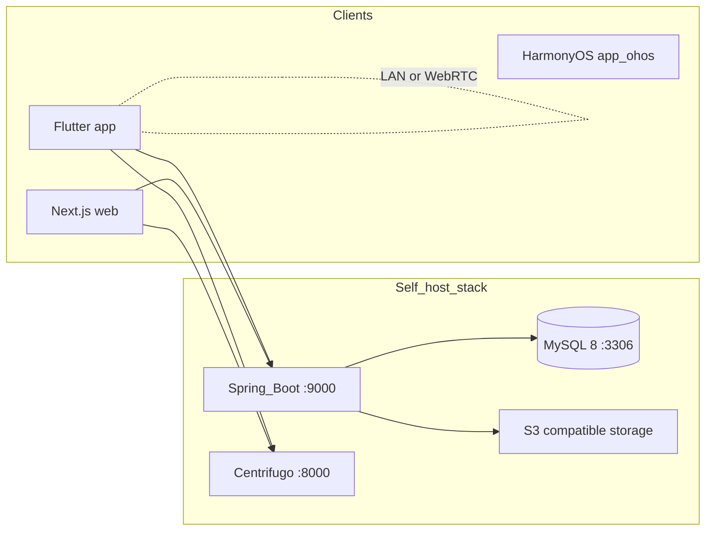

# ShrimpSend (虾传)

**English (default)** | [简体中文](docs/README.zh-CN.md)

<p align="center">
  
</p>

<p align="center">
  <strong>Reliable transfer between your devices — even on difficult networks.</strong><br />
  LAN when possible. Relay when needed. Resume when interrupted.
</p>

<p align="center">
  <a href="LICENSE"></a>
  
  <a href="https://github.com/shrimpsend/shrimpsend"></a>
</p>

<p align="center">
  
</p>

## Official hosted services

ShrimpSend / 虾传 runs two official hosted editions from the same open-source codebase. Pick the site that matches where you are:

| Edition | Website | For |
|---------|---------|-----|
| **China (国内版)** | [xiachuan.net](https://xiachuan.net) | Users in mainland China |
| **International** | [shrimpsend.com](https://shrimpsend.com) | Users outside mainland China |

You can also [self-host](#deployment) the full stack on your own infrastructure under AGPL.

This repository (**`shrimpsend`**) is the open-source codebase for **ShrimpSend** / **虾传** — a self-hostable relay for your personal devices. Send text, clipboard snippets, images, videos, and large files between phones, desktops, and browsers. It is built for **complex networks**: go as fast as your LAN allows on direct paths, keep transfers alive across NAT and restrictive Wi‑Fi, and resume large files after disconnects. It is not a cloud drive and not an “upload, get a link, forward the link” workflow.

## Why ShrimpSend

- **No install for recipients** — send directly to browsers and temporary devices when the other side cannot install software.
- **Resume after disconnects** — large native client ↔ client transfers continue from the interrupted position instead of restarting from 0%.
- **Works on restrictive networks** — server-assisted relay when hotel Wi‑Fi, campus networks, or carrier NAT block direct reachability.
- **Breaks through one-way networks** — firewalls and NAT often allow traffic in only one direction (e.g. phone → PC works, PC → phone does not). After sign-in, the server coordinates reachability probes between your devices; if direct HTTP push fails, ShrimpSend automatically **reverse-pulls** the file from the reachable side, or falls back to WebRTC / S3 relay. See [shared/protocol.md](shared/protocol.md#反向拉取-reverse-pull).
- **LAN-first, still built for speed** — prefer direct LAN / WebRTC on the same network; use relay or S3-compatible fallback only when needed.
- **Real-time sync** — [Centrifugo](https://centrifugal.dev/) pushes updates to every signed-in client on channel `user#<userId>`.
- **Self-host friendly** — run the full stack on your infrastructure under [AGPL-3.0-or-later](LICENSE); production secrets stay in private ops templates ([docs/SELF_HOST.md](docs/SELF_HOST.md)).

## Screenshots

<p align="center">
  
</p>

<p align="center">
  
</p>

<p align="center">
  
</p>

<p align="center">
  
</p>

## Architecture



| Component | Port | Role |
|-----------|------|------|
| MySQL 8 | 3306 | Primary database |
| Centrifugo v6 | 8000 | WebSocket real-time |
| Spring Boot backend | 9000 | REST API, auth, S3 orchestration |
| Next.js web | 3000 | Browser client |

**Transfer paths:** on the same LAN, HTTP direct push or reverse pull and optional WebRTC aim for maximum throughput; across restrictive or unstable networks, server-assisted relay and S3-compatible fallback keep delivery reliable. Large native transfers can resume after disconnects. Details: [shared/protocol.md](shared/protocol.md).

## Tech stack

- **Backend:** Spring Boot (Java 17), MySQL 8
- **Web:** Next.js (React)
- **Clients:** Flutter (iOS, Android, macOS, Windows, Linux), HarmonyOS (`app_ohos/`)
- **Real-time:** Centrifugo

## Deployment

### Prerequisites

| Tool | Version / notes |
|------|-----------------|
| Java | 17+ |
| Node.js | 20+ (for `web/`) |
| [Centrifugo](https://centrifugal.dev/) | Dev: `./scripts/install-centrifugo.sh` (prefers [centrifugo-bins](https://github.com/shrimpsend/centrifugo-bins)); production: `sync-to-build-machine.sh` auto-fetches `scripts/bin/linux/centrifugo` (not in git) |
| MySQL | 8 |
| Flutter | Only when building `app/` |

**Before first `./scripts/start-dev.sh`:** run `cd web && npm ci` and `./scripts/install-centrifugo.sh` (or run `./scripts/sync-to-build-machine.sh` earlier to fetch the Linux binary only). The start script picks `scripts/bin/mac/` or `scripts/bin/linux/` by OS.

### Local development (China logic)

| Role | Setup | Start / stop |
|------|--------|--------------|
| **Maintainers** (private `ops/local/`) | `./scripts/deploy-local.sh` — syncs team config + creates `ultrasend` / `ultrasend_overseas` DBs | `./start-dev.sh` or `./scripts/start-dev.sh` · stop: `./stop-dev.sh` |
| **Contributors** (examples only) | `./scripts/setup-local-config.sh` — copies `*.example` templates | Same start/stop |

**Contributors only:** create the MySQL database before first start:

```sql
CREATE DATABASE ultrasend CHARACTER SET utf8mb4 COLLATE utf8mb4_unicode_ci;
```

Default JDBC: `jdbc:mysql://localhost:3306/ultrasend`, user `root`, password `changeme`. Override via `backend/.env` (`SPRING_DATASOURCE_*`).

| Service | URL |
|---------|-----|
| Centrifugo | http://localhost:8000 |
| Backend API | http://localhost:9000 |
| Web UI | http://localhost:3000 |

Logs: `scripts/logs/` · PID file: `scripts/.dev-pids`

Dev scripts live under **`scripts/`** in this repo (not in the private ops repo), so paths to `web/`, `backend/`, and `config.json` resolve correctly. Root `./start-dev.sh` / `./stop-dev.sh` are shortcuts to `scripts/`.

### Local development (Overseas / ShrimpSend logic)

Same config step as above (`deploy-local.sh` or `setup-local-config.sh`). Maintainers get `ultrasend_overseas` from `deploy-local.sh`.

```bash
./scripts/start-dev.sh --overseas
# Stop: ./scripts/stop-dev.sh
```

Uses Spring profile `dev-overseas` and database `ultrasend_overseas`. For Stripe membership testing, run in a separate terminal:

```bash
stripe listen --forward-to localhost:9000/api/membership/stripe/webhook
```

Backend-only debugging (no Centrifugo/Web): `backend/scripts/run-dev-overseas.sh`

### Production (bare metal)

Requires an **ops** config directory synced into this repo. Full steps: [docs/SELF_HOST.md](docs/SELF_HOST.md#production-deployment).

```bash
git clone git@github.com:shrimpsend/shrimpsend.git shrimpsend
cd shrimpsend
git clone git@github.com:shrimpsend/public-ops.git ../ops   # samples; replace placeholders for production
# Maintainers: git clone git@github.com:shrimpsend/ops.git ../ops
# Optional: export ULTRASEND_OPS_DIR=/path/to/your-ops
./scripts/deploy.sh          # interactive: git pull, cn vs overseas, build, restart
./scripts/deploy.sh stop     # stop Centrifugo + backend + Web
./scripts/deploy.sh status
./scripts/deploy.sh logs
```

Non-interactive overseas deploy:

```bash
SPRING_PROFILE=prod-overseas CLUSTER_LABEL='Overseas (ShrimpSend)' ./scripts/deploy.sh
```

### Docker (optional)

MySQL + Centrifugo + backend in containers; Web still runs on the host.

```bash
./scripts/setup-local-config.sh   # or deploy-local for ops/local/docker.env → .env
docker compose up -d
./scripts/start-dev.sh            # Web only path if you skip full stack script
```

See [docs/README.zh-CN.md](docs/README.zh-CN.md) (Chinese, includes troubleshooting) · [docs/SELF_HOST.md](docs/SELF_HOST.md)

## Build clients (Flutter)

```bash
cd app
flutter pub get
flutter run
# Optional overrides:
# flutter run --dart-define=API_URL=http://localhost:9000 \
#   --dart-define=CENTRIFUGO_WS=ws://localhost:8000/connection/websocket
```

OpenPanel secrets and analytics: [app/README.md](app/README.md).

## Self-hosting and configuration

| Scenario | Config | Start |
|----------|--------|-------|
| Local (China) | `setup-local-config.sh` or `deploy-local.sh` | `./scripts/start-dev.sh` |
| Local (Overseas) | same | `./scripts/start-dev.sh --overseas` |
| Production | `ops/` sync via `deploy.sh` | `./scripts/deploy.sh` |
| Docker | `.env` + `config.docker.json` | `docker compose up -d` |

Full guide: [docs/SELF_HOST.md](docs/SELF_HOST.md) · Chinese setup: [docs/README.zh-CN.md](docs/README.zh-CN.md)

## Official vs community builds

Trademarks **ShrimpSend** / **虾传** are not licensed under AGPL. Community forks **must**:

1. **Not** ship under the ShrimpSend / 虾传 name, logo, or confusingly similar branding (including app stores).
2. Use **distinct** application names and package/bundle IDs (Flutter `applicationId`, iOS bundle ID, etc.).
3. Default API/WebSocket endpoints to **your** servers — not `api.shrimpsend.com` or `api.xiachuan.net`.
4. Clearly state the deployment is independent (e.g. “AcmeSend — self-hosted, not affiliated with ShrimpSend”).

Official hosted services (reference only): [shrimpsend.com](https://shrimpsend.com) (international), [xiachuan.net](https://xiachuan.net) (China). Full policy: [TRADEMARK.md](TRADEMARK.md).

## Project layout

```
shrimpsend/
├── backend/          # Spring Boot API
├── web/              # Next.js web app
├── app/              # Flutter clients
├── app_ohos/         # HarmonyOS
├── ops/              # Production templates (secrets gitignored)
├── shared/           # Protocol notes
├── config.json       # Centrifugo (generated locally)
└── docker-compose.yml
```

## Features (overview)

- User registration/login, JWT auth
- Device registry with unique `deviceId` and display names
- Real-time messages on `user#<userId>`
- Text + file messages (S3 presigned upload/download)
- Per-send choice: all devices (S3) or a specific peer (LAN direct when possible)
- Browser receive without asking others to install the app
- Resume large transfers after network drops (native client ↔ client)
- Server-assisted paths across NAT, campus Wi‑Fi, and carrier networks (signed-in)
- Settings: S3 credentials, device list, renames

## Documentation

| Topic | Document |
|-------|----------|
| Self-hosting | [docs/SELF_HOST.md](docs/SELF_HOST.md) |
| Transfer protocol | [shared/protocol.md](shared/protocol.md) |
| Contributing + DCO | [CONTRIBUTING.md](CONTRIBUTING.md), [DCO.md](DCO.md) |
| Security disclosures | [SECURITY.md](SECURITY.md) |
| Setup guide (Chinese) | [docs/README.zh-CN.md](docs/README.zh-CN.md) |
| License (Chinese summary) | [LICENSE.zh-CN.md](LICENSE.zh-CN.md) |
| Third-party licenses | [THIRD_PARTY_NOTICES.md](THIRD_PARTY_NOTICES.md) |
| Trademark / fork naming | [TRADEMARK.md](TRADEMARK.md) |

## Contributing

Issues and pull requests: [github.com/shrimpsend/shrimpsend](https://github.com/shrimpsend/shrimpsend). Read [CONTRIBUTING.md](CONTRIBUTING.md) (DCO sign-off required: `git commit -s`).

## License

**SPDX:** `AGPL-3.0-or-later`

ShrimpSend / 虾传 is released under the [GNU Affero General Public License v3.0 or later](LICENSE). You may use, modify, and self-host freely; if you modify the software and offer network access to users, AGPL requires making corresponding source available to those users.

| Document | Description |
|----------|-------------|
| [LICENSE](LICENSE) | Full AGPL-3.0 text |
| [LICENSE.zh-CN.md](LICENSE.zh-CN.md) | Chinese license summary |
| [LICENSE-Commercial.md](LICENSE-Commercial.md) | Enterprise license (when AGPL is not acceptable) |
| [TRADEMARK.md](TRADEMARK.md) | Trademark and fork branding |
| [THIRD_PARTY_NOTICES.md](THIRD_PARTY_NOTICES.md) | Third-party dependency notices |
| [CONTRIBUTING.md](CONTRIBUTING.md) | Contribution guide (incl. DCO) |
