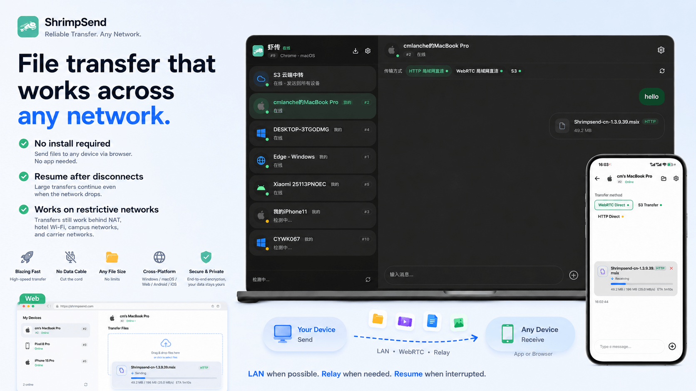
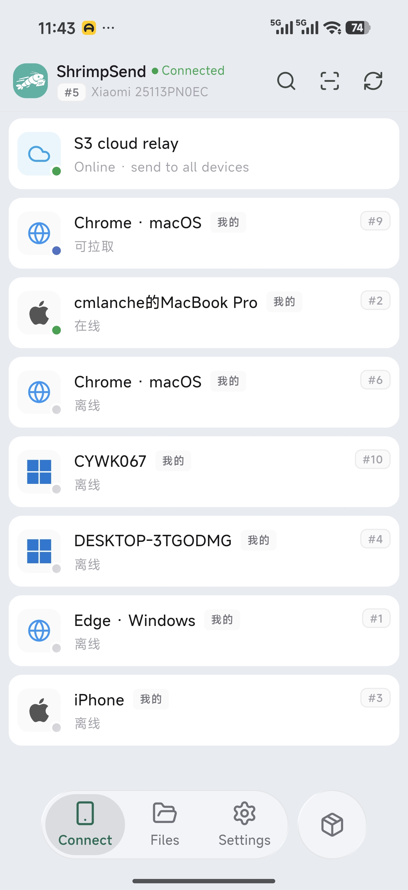
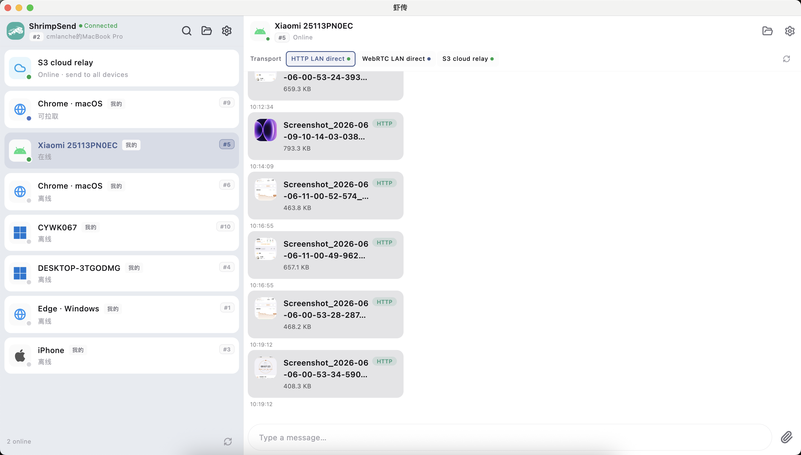
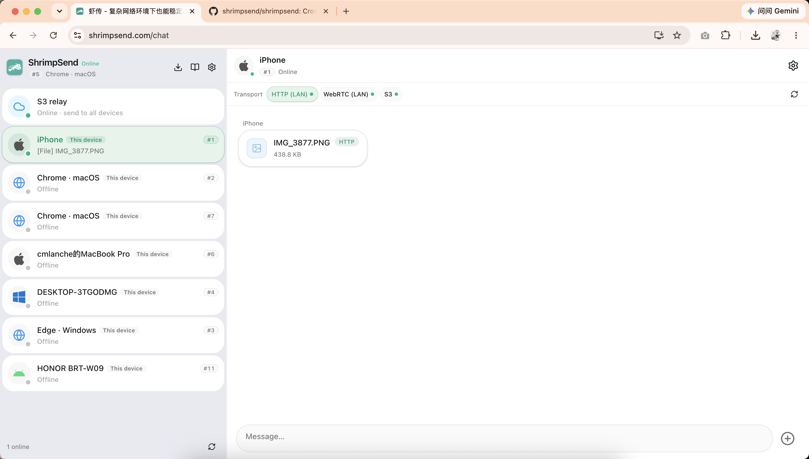
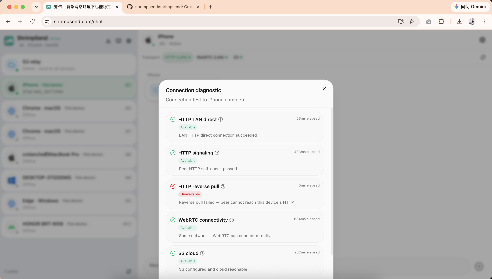
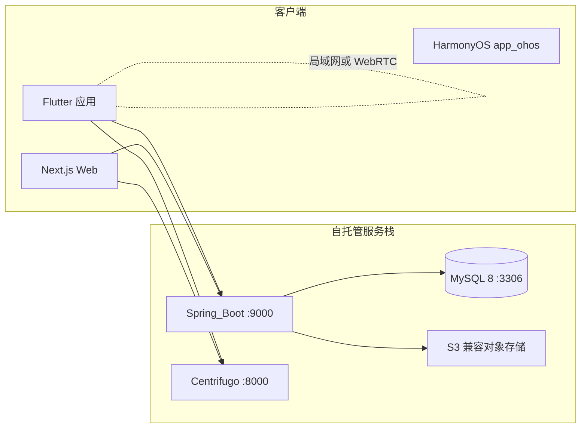

# ShrimpSend（虾传）

[English](../README.md) | **简体中文**

<p align="center">
  
</p>

<p align="center">
  <strong>复杂网络环境下，设备之间也能稳定互传。</strong><br />
  能局域网就局域网，需要中继就中继，断了还能续传。
</p>

<p align="center">
  <a href="../LICENSE"></a>
  
  <a href="https://github.com/shrimpsend/shrimpsend"></a>
</p>

<p align="center">
  
</p>

## 官方托管版本

虾传 / ShrimpSend 基于同一份开源代码，提供两个官方托管站点，请按所在地区选择：

| 版本 | 网址 | 适用 |
|------|------|------|
| **国内版** | [xiachuan.net](https://xiachuan.net) | 中国大陆用户 |
| **国际版** | [shrimpsend.com](https://shrimpsend.com) | 中国大陆以外用户 |

你也可以在自有服务器上按 [AGPL](../LICENSE) [自托管](#部署指南) 完整服务栈。

本仓库（**`shrimpsend`**）是 **ShrimpSend / 虾传** 的开源源码。面向个人多设备，在手机、电脑与浏览器之间互传文本、剪贴板、图片、视频和大文件。它专为**复杂网络**设计：能直连时尽量跑满带宽，在 NAT 与受限 Wi‑Fi 下仍可用，大文件断网可续传。它不是网盘，也不是「上传生成链接再转发」的工具。

## 为何选择虾传

- **对方不用安装也能收** — 文件可直接发到浏览器和临时设备，适合客户机不能装软件、访客设备或一次性分享。
- **断网后可续传** — 原生客户端之间的大文件可从中断处继续，不必从 0% 重来。
- **复杂网络下仍可用** — 酒店 Wi‑Fi、校园网、运营商 NAT 等场景下，可通过服务端辅助中继保持传输可用。
- **打通单向网络** — 防火墙或 NAT 常只允许单向连通（例如同网 Windows 拦截入站，手机能推电脑但电脑推不回手机）。登录后由服务器协调两端互相探测可达路径；HTTP 直推失败时自动改为对端**反向拉取**本机文件，必要时退回 WebRTC 或 S3 中继。详见 [shared/protocol.md](../shared/protocol.md#反向拉取-reverse-pull)。
- **局域网优先，也追求速度** — 同网优先直连 / WebRTC；仅在需要时使用中继或 S3 兼容后备。
- **实时同步** — 登录设备订阅频道 `user#<userId>`，消息即时推送。
- **可自托管** — 完整栈可在自有环境运行（[AGPL-3.0-or-later](../LICENSE)）；生产密钥放在私有 ops 模板（[SELF_HOST.md](SELF_HOST.md)）。

## 界面预览

<p align="center">
  
</p>

<p align="center">
  
</p>

<p align="center">
  
</p>

<p align="center">
  
</p>

## 架构



| 组件 | 端口 | 说明 |
|------|------|------|
| MySQL 8 | 3306 | 主数据库 |
| Centrifugo v6 | 8000 | WebSocket 实时通道 |
| Spring Boot 后端 | 9000 | REST API、认证、S3 编排 |
| Next.js Web | 3000 | 浏览器客户端 |

传输细节：同网 HTTP 直推/反向拉取与可选 WebRTC 尽量跑满带宽；跨受限或不稳定网络时，服务端辅助中继与 S3 兼容后备保证可靠送达；原生客户端之间的大文件支持断点续传。详见 [shared/protocol.md](../shared/protocol.md)。

## 技术栈

- **后端**: Spring Boot (Java 17)，数据库 **MySQL 8**
- **Web**: Next.js (React)
- **跨平台客户端**: Flutter (macOS / Windows / Linux / iOS / Android)
- **鸿蒙**: `app_ohos/`
- **实时**: Centrifugo

## 部署指南

### 环境要求

| 工具 | 版本 / 说明 |
|------|-------------|
| Java | 17+ |
| Node.js | 20+（`web/`） |
| [Centrifugo](https://centrifugal.dev/) | 本地：`./scripts/install-centrifugo.sh`（优先 [centrifugo-bins](https://github.com/shrimpsend/centrifugo-bins)）；生产：`sync-to-build-machine.sh` 自动拉取 `scripts/bin/linux/centrifugo`（不入库） |
| MySQL | 8 |
| Flutter | 仅构建 `app/` 时需要 |

**首次运行 `./scripts/start-dev.sh` 前：** 执行 `cd web && npm ci` 与 `./scripts/install-centrifugo.sh`（或事先 `./scripts/sync-to-build-machine.sh` 仅补 linux 二进制）。启动脚本会按当前系统选择 `scripts/bin/mac/` 或 `scripts/bin/linux/` 下的二进制。

### 本地开发（国内逻辑）

| 角色 | 配置 | 启动 / 停止 |
|------|------|-------------|
| **维护者**（私有 `ops/local/`） | `./scripts/deploy-local.sh` — 同步团队配置并初始化 `ultrasend`、`ultrasend_overseas` 库 | `./scripts/start-dev.sh` · 停止：`./scripts/stop-dev.sh` |
| **贡献者**（仅 example 模板） | `./scripts/setup-local-config.sh` — 从 `*.example` 生成本地文件 | 同上 |

**贡献者**首次启动前需手动建库（维护者由 `deploy-local.sh` 自动完成，除非 `--skip-db`）：

```sql
CREATE DATABASE ultrasend CHARACTER SET utf8mb4 COLLATE utf8mb4_unicode_ci;
```

默认 JDBC：`jdbc:mysql://localhost:3306/ultrasend`，用户 `root`，密码 `changeme`。可在 `backend/.env` 中设置 `SPRING_DATASOURCE_*`。

| 服务 | 地址 |
|------|------|
| Centrifugo | http://localhost:8000 |
| 后端 API | http://localhost:9000 |
| Web | http://localhost:3000 |

日志：`scripts/logs/` · 进程 PID：`scripts/.dev-pids`

`setup-local-config.sh` 会从 `*.example` 生成 `config.json`、`web/.env.local`、`backend/.env` 等（不覆盖已有文件）。若存在 `ops/local/`，会自动调用 `scripts/sync-to-local.sh`（与 `deploy-local.sh` 等价）。

### 本地开发（海外 / ShrimpSend 逻辑）

配置步骤与国内相同。维护者执行 `deploy-local.sh` 时会创建 `ultrasend_overseas` 库。

```bash
./scripts/start-dev.sh --overseas
# 停止：./scripts/stop-dev.sh
```

使用 Spring profile `dev-overseas`，数据库 `ultrasend_overseas`。测试 Stripe 会员时，另开终端：

```bash
stripe listen --forward-to localhost:9000/api/membership/stripe/webhook
```

**仅调试后端**（不启 Centrifugo/Web）：`backend/scripts/run-dev-overseas.sh`

### 生产部署（裸机）

需 **ops** 配置目录同步到本仓。完整说明：[SELF_HOST.md](SELF_HOST.md)。

```bash
git clone git@github.com:shrimpsend/shrimpsend.git shrimpsend
cd shrimpsend
git clone git@github.com:shrimpsend/public-ops.git ../ops   # 公开样例；生产前替换占位值
# 维护者：git clone git@github.com:shrimpsend/ops.git ../ops
# 可选：export ULTRASEND_OPS_DIR=/path/to/your-ops
./scripts/deploy.sh          # 交互：拉代码、选国内/海外、构建、重启
./scripts/deploy.sh stop
./scripts/deploy.sh status
./scripts/deploy.sh logs
```

海外非交互部署：

```bash
SPRING_PROFILE=prod-overseas CLUSTER_LABEL='海外 (ShrimpSend)' ./scripts/deploy.sh
```

`deploy.sh` 内可再次确认是否从 ops 同步；也可事先单独运行 `scripts/sync-to-build-machine.sh`。

| 集群 | Spring profile | Centrifugo 配置 |
|------|----------------|-----------------|
| 国内 xiachuan | `prod` | `config.prod.bare.json` |
| 海外 ShrimpSend | `prod-overseas` | `config.prod-overseas.bare.json` |

### Docker Compose（可选）

容器内运行 MySQL + Centrifugo + 后端；**Web 不在 Compose 内**，需在宿主机启动。

```bash
./scripts/setup-local-config.sh   # 或 deploy-local 同步 ops/local/docker.env → .env
docker compose up -d
./scripts/start-dev.sh            # 在宿主机启动 Web（及可选的全栈）
```

Compose 使用 `config.docker.json`（proxy 指向 `backend:9000`）；本机脚本使用 `config.json`（localhost）。**无需**在宿主机先执行 `gradlew bootJar`（镜像构建时已完成）。

### 环境变量（可选）

- **Web** — `web/.env.local`（`setup-local-config.sh` 或 `deploy-local` 已从 example 复制）
  - `NEXT_PUBLIC_API_URL`：默认 `http://localhost:9000`
  - `NEXT_PUBLIC_CENTRIFUGO_WS`：默认 `ws://localhost:8000/connection/websocket`
  - OpenPanel / Stripe secret 仅放 `.env.local`
- **Flutter** — `API_URL`、`CENTRIFUGO_WS` 可通过 `--dart-define` 覆盖

### 排障：单独启动各组件

以下**不是**推荐主流程，仅用于调试某一服务。全栈请始终使用 `./scripts/start-dev.sh` 或 `./scripts/start-dev.sh --overseas`。

**Centrifugo**

```bash
centrifugo -c config.json
```

**后端**

```bash
cd backend && ./gradlew bootRun
# 海外逻辑：export SPRING_PROFILES_ACTIVE=dev-overseas && ./gradlew bootRun
```

**Web**

```bash
cd web && npm install && npm run dev
```

## 构建客户端（Flutter）

```bash
cd app
flutter pub get
flutter run
# 可选：
# flutter run --dart-define=API_URL=http://localhost:9000 \
#   --dart-define=CENTRIFUGO_WS=ws://localhost:8000/connection/websocket
```

OpenPanel 与客户端统计说明：[app/README.md](../app/README.md)。

## 自托管与配置

| 场景 | 配置 | 启动 |
|------|------|------|
| 本地（国内） | `setup-local-config.sh` 或 `deploy-local.sh` | `./scripts/start-dev.sh` |
| 本地（海外） | 同上 | `./scripts/start-dev.sh --overseas` |
| 生产 | ops 同步 + `deploy.sh` | `./scripts/deploy.sh` |
| Docker | `.env` + `config.docker.json` | `docker compose up -d` |

完整指南：[SELF_HOST.md](SELF_HOST.md) · 运维配置：[ops/README.md](../ops/README.md)

## 官方实例与社区构建

**ShrimpSend / 虾传** 商标不受 AGPL 授权。社区 Fork **必须**：

1. **不得** 以 ShrimpSend / 虾传名称、Logo 或易混淆品牌发布（含应用商店）。
2. 使用**独立**应用名与包名/bundle ID（修改 Flutter `applicationId`、iOS bundle ID 等）。
3. 默认 API/WebSocket 指向**你自己的**服务器，而非 `api.shrimpsend.com` 或 `api.xiachuan.net`。
4. 明确标注与官方无关（例如：「AcmeSend — 自托管，与虾传无关联」）。

官方托管服务（仅供参考）：[shrimpsend.com](https://shrimpsend.com)（海外）、[xiachuan.net](https://xiachuan.net)（中国大陆）。详见 [TRADEMARK.md](../TRADEMARK.md)。

## 项目结构

```
shrimpsend/
├── backend/          # Spring Boot
├── web/              # Next.js
├── app/              # Flutter (iOS/Android/desktop)
├── app_ohos/         # HarmonyOS
├── ops/              # 生产配置模板（敏感子目录 gitignored，见 ops/README.md）
├── config.json       # Centrifugo 本地配置（setup-local-config 生成）
├── shared/           # 协议说明
└── docker-compose.yml
```

## 功能概览

- 用户注册/登录，JWT 认证
- 设备注册与名称（deviceId 唯一）
- 实时消息：每用户一个频道 `user#<userId>`，多端订阅
- 文本消息 + 文件消息（S3 预签名上传/下载）
- 发送文件时可选「全部设备 (S3)」或「指定设备 (局域网)」；指定设备时尝试 WebSocket 直连
- 浏览器接收，对方无需安装 App
- 大文件断网续传（原生客户端之间）
- 跨 NAT、校园网、运营商 NAT 的服务端辅助路径（需登录）
- 设置页：S3 配置、设备列表与改名

## 文档索引

| 主题 | 文档 |
|------|------|
| 自托管部署 | [SELF_HOST.md](SELF_HOST.md) |
| 传输协议 | [shared/protocol.md](../shared/protocol.md) |
| 贡献与 DCO | [CONTRIBUTING.md](../CONTRIBUTING.md)、[DCO.md](../DCO.md) |
| 安全披露 | [SECURITY.md](../SECURITY.md) |
| 许可说明（中文摘要） | [LICENSE.zh-CN.md](../LICENSE.zh-CN.md) |
| 第三方许可 | [THIRD_PARTY_NOTICES.md](../THIRD_PARTY_NOTICES.md) |
| 商标与 Fork 命名 | [TRADEMARK.md](../TRADEMARK.md) |

## 贡献

Issue 与 Pull Request：[github.com/shrimpsend/shrimpsend](https://github.com/shrimpsend/shrimpsend)。请先阅读 [CONTRIBUTING.md](../CONTRIBUTING.md)（提交需 DCO：`git commit -s`）。

## 开源许可

**SPDX:** `AGPL-3.0-or-later`

ShrimpSend / 虾传（本仓库 `shrimpsend`）以 [GNU Affero General Public License v3.0 或更高版本](../LICENSE) 发布。你可以自由使用、修改与自托管；若修改后对外提供网络服务，须按 AGPL 向用户提供相应源码。中文摘要见 [LICENSE.zh-CN.md](../LICENSE.zh-CN.md)。

| 文档 | 说明 |
| --- | --- |
| [LICENSE](../LICENSE) | AGPL-3.0 完整正文 |
| [LICENSE.zh-CN.md](../LICENSE.zh-CN.md) | 许可说明（中文摘要） |
| [LICENSE-Commercial.md](../LICENSE-Commercial.md) | 企业商业授权（无法遵守 AGPL 时联系版权方） |
| [TRADEMARK.md](../TRADEMARK.md) | 商标与 Fork 命名规范 |
| [THIRD_PARTY_NOTICES.md](../THIRD_PARTY_NOTICES.md) | 第三方依赖许可证清单 |
| [CONTRIBUTING.md](../CONTRIBUTING.md) | 贡献指南（含 DCO） |

## 说明

- 仓库首页默认展示英文 [README.md](../README.md)；本文为中文完整说明。
- 局域网文件传输协议见 [shared/protocol.md](../shared/protocol.md)。
- 本地开发密钥由 `setup-local-config.sh` 生成；生产环境使用私有 ops 仓，公开仓库仅含 `*.example` 模板。
