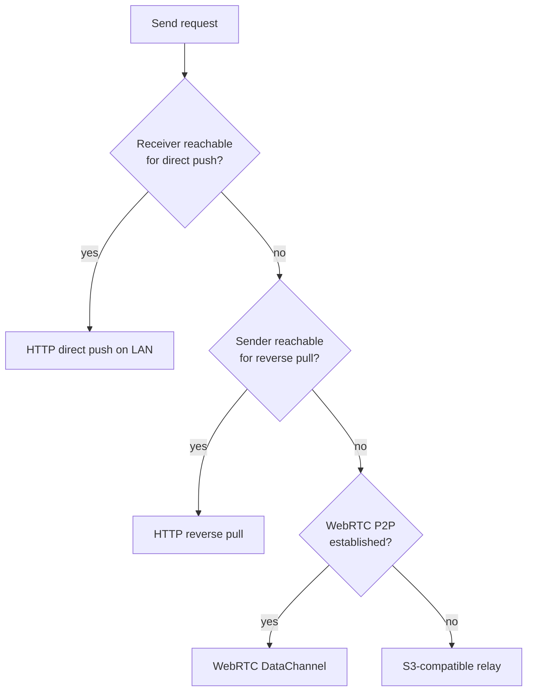

# ShrimpSend Transfer Protocol (English summary)

This is a condensed English overview of the ShrimpSend / 虾传 transfer protocol for readers who do not read Chinese. The full, authoritative specification lives in [shared/protocol.md](protocol.md); when the two disagree, the Chinese document wins.

ShrimpSend moves data between a user's own devices. It picks the best available path at send time and degrades gracefully when the network is hostile, rather than failing the transfer. The paths, in order of preference, are: HTTP direct push on the LAN, HTTP reverse pull, WebRTC peer-to-peer, and S3-compatible relay.

## Why a multi-path protocol

"Same network" does not guarantee two devices can reach each other. A Windows firewall commonly blocks inbound connections, so a phone can push to a PC while the PC cannot push back. Devices may sit on different subnets (Ethernet vs. Wi-Fi, or behind a secondary router) even at home. Hotel, campus, and carrier networks add NAT and restrictive firewalls. ShrimpSend treats one-way reachability as the normal case and is built to work around it.

## HTTP direct push (LAN)

The sender posts the file body directly to the receiver:

- `POST /transfer` with headers `X-File-Name`, `X-File-Size`, and `Content-Type: application/octet-stream`.
- Resume is supported with optional `X-File-Id` and `X-Resume-Offset` headers; the body starts at the requested offset.
- `GET /probe` returns `200 OK` and is used for reachability checks.
- `GET /transfer-status?fileId=...` returns an `X-Received-Bytes` header so the sender can learn how much has already landed. `fileId` is derived from `hash(fileName)_fileSize`.

## Reverse pull

When direct push fails because the receiver cannot accept inbound connections, the protocol flips direction: the reachable side exposes the file and the other side pulls it.

- `GET /download?offerId=...` serves the file.
- `Range: bytes=start-` requests are honored and answered with `206 Partial Content` and a `Content-Range` header, so an interrupted pull resumes instead of restarting.

After sign-in, the server coordinates reachability probes between the two devices and decides whether to push or pull, so this is automatic rather than a manual user choice.

## WebRTC peer-to-peer

When neither HTTP path works directly but a peer connection can still be negotiated, ShrimpSend uses WebRTC.

- Signaling messages travel over Centrifugo: `webrtc_offer`, `webrtc_answer`, `webrtc_ice_candidate`, and `webrtc_transfer_cancel`.
- A `control` DataChannel carries JSON control messages; each file gets its own `file-{fileId}` DataChannel transferred in 16 KB chunks.
- Control messages cover the full lifecycle: `file_start`, `file_end`, `file_ack`, `progress` (for end-to-end flow control), `file_resume_request` / `file_resume_accept` (for resume), and `session_complete`.
- Resume flow: the receiver checks for a partially received temp file after `file_start`, sends `file_resume_request` with the bytes it already has, and the sender replies `file_resume_accept` with the offset to continue from. The receiver flushes partial data to a temp file roughly every 2 MB.

## S3-compatible relay (fallback)

S3 is a fallback path, not a replacement for LAN transfer. It keeps delivery reliable when devices are on different networks or the network is constrained. Storage can be the hosted bucket or a user-supplied S3-compatible endpoint.

- Small files (< 5 MB): `POST /api/s3/presign-upload` returns a presigned PUT URL; download via `GET /api/s3/download-url?key=...`.
- Large files (>= 5 MB) use multipart upload with resume: `POST /api/s3/multipart/initiate`, `POST /api/s3/multipart/presign-part` per part, `PUT` each part to its presigned URL, then `POST /api/s3/multipart/complete` (or `.../abort`). Download resume uses the HTTP `Range` header.

## Integrity

- The sender computes a SHA-256 hash before upload and sends it via `X-File-Hash` on LAN paths.
- For S3, ETag can be used for verification.
- After a transfer completes, the receiver can verify the hash matches.

## Real-time sync

Centrifugo pushes updates to every signed-in client on the channel `user#<userId>`, which is also how WebRTC signaling and device/conversation state propagate across a user's devices in real time.
